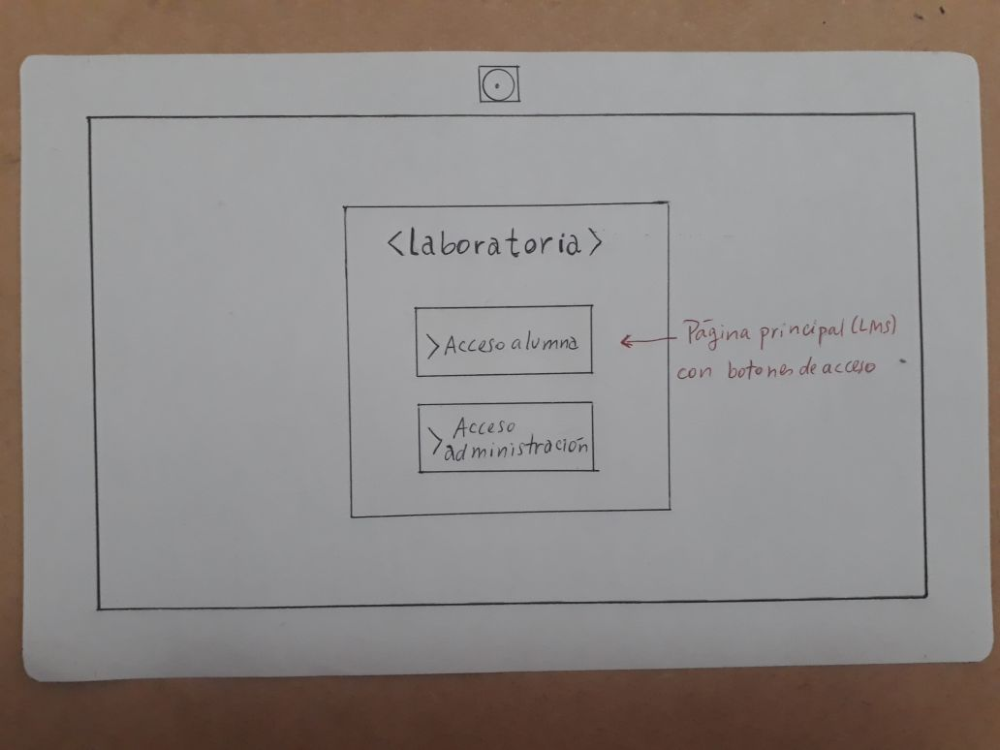
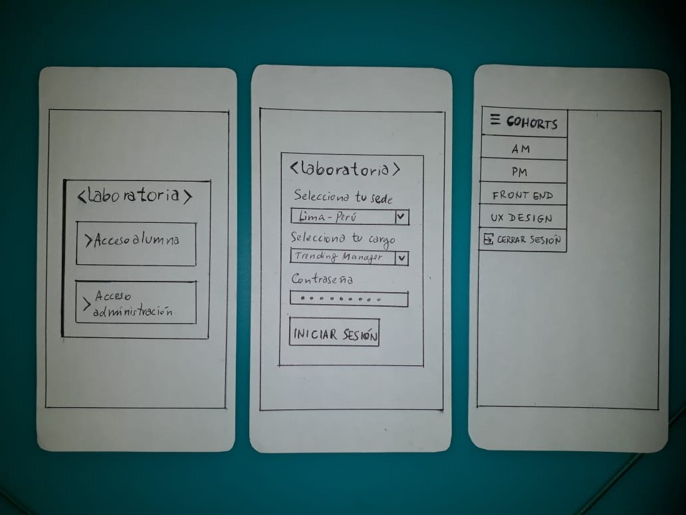
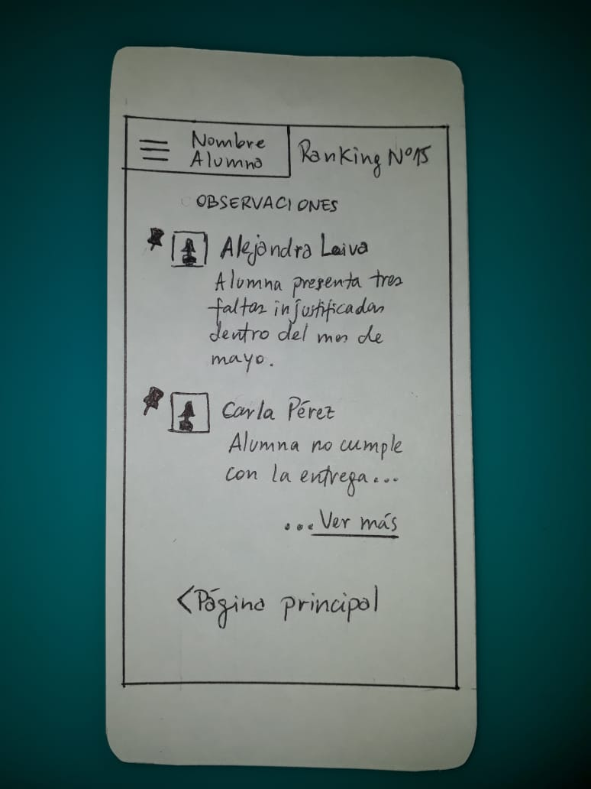

<h1>Data Dashboard<h1>

<h2>Introduction<h2>

En Laboratoria, las Training Managers (TMs) hacen un gran trabajo al analizar la mayor cantidad de datos posibles respecto al progreso de las estudiantes para apoyarlas en su aprendizaje.

La principal medida de progreso de una estudiante en Laboratoria es su avance completando los proyectos de la Ruta de Aprendizaje y su desempeño en función a la Rúbrica de Niveles Esperados. Sin embargo, para completar estos proyectos las estudiantes acceden a contenidos de aprendizaje (lecturas, videos, ejercicios y quizzes) en un sistema que llamamos LMS (Learning Management System). El LMS acumula data sobre quién leyó qué, qué ejercicios se han completado, los resultados de los quizzes, etc.

A pesar de que la data de progreso del LMS (ej. lecturas leídas, ejercicios completados, nota en quizzes, etc.) no impacta directamente la evaluación de una estudiante, sí es una pieza de información relevante que las TMs quisieran visualizar para tener un mejor entendimiento de cómo va cada estudiante en su proceso de aprendizaje.

<h2>User Experience Design<h2>

Nuestro producto está enfocado en brindarle una solución a las Trending Managers de Laboratoria, quienes serían las usuarias finales de este producto, y como ejemplo tomamos como referencia a Valentina Fernández Smith, quien es la actual Trending Manager de la sede Santiago de Chile (SCL) de Laboratoria.

Para tener una idea del diseño de la página hemos recurrido a entrevistas y conversaciones con Valentina, observación del contexto en que se encuentra y llegamos a la conclusión de que el Data Dashboard debería estar vinculada a la plataforma LMS de Laboratoria, que es la página a la cual tendrían acceso tanto las alumnas, como los couch y las Trending Manager de Laboratoria, con sus respectivas claves de acceso, por lo tanto esta plataforma de información tratará de ajustarse lo más posible al formato del LMS.

El principal problema a resolver en este proyecto, es la constante necesidad de acceder a los datos de las alumnas, para tomar decisiones respecto a su avance en el bootcamp, por ejemplo tablas y gráficos que muestren su progreso con respecto a las materias que se van pasando diariamente en el bootcamp, y ver su avance respecto al resto de las alumnas. Por lo tanto, se necesita tener información clara y resumida para tomar las decisiones, ya que según una entrevista que le hicimos a Valentina, sólo tienen acceso a tablas excel con los datos, y le resulta muy engorroso y poco eficiente este sistema a la hora de evaluar a las alumnas, ya que ella necesita hacer reuniones semanales vía Streaming con las demás Trending Manager de Laboratoria, y además hacer comparaciones con el resto de las sedes.

<h3>Diseño de la página<h3>

En las siguientes imágenes tenemos una sketch previo de cómo debería verse el producto final. 

1. Como primer paso hemos hecho un sketch en papel para tener una idea de cómo será la organización de la página (en formato desktop).
Cabe mencionar que, debido a que la funcionalidad pueda cambiar algunas cosas, el producto final podrá sufrir algunas modificaciones.

  1- Página principal del LMS que tiene dos botones de acceso (alumnas y administración)
  
  

  2- Luego de hacer click en el botón "Acceso administración" aparecerá un input desplegable para elegir la sede de Laboratoria a la cual se quiere acceder, y otro input desplegable para elegir el cargo dentro de Laboratoria, además de un input donde ingresar la contraseña y un botón para aceceder al data dashboard.

  .jpeg)

  3- Luego de acceder iniciar sesión aparecerá un gráfico con el resúmen general del progreso del bootcamp,al costado derecho unos recuadros que indiquen las materias con mayor y menor porcentaje de avance dentro del bootcamp. Debajo del gráfico habrá una barra de búsqueda para acceder a los datos de avance de cada alumna. 

  .jpeg)

  4- Luego de ingresar a la barra de búsqueda aparecerá una página con una barra lateral izquierda, donde aparecerá la foto y nombre de la alumna, debajo de la foto un menú con las habilidades (soft skills y tech skills), observaciones y asistencia. En la pantalla principal de la alumna aparecerán sus habilidades de autogestión y de relaciones interpersonales como pestañas desplegables para poder ver en detalle sus auto evaluaciones, las evaluaciones de sus compañeras y de sus couch. Y en la parte superior,al lado de la foto aparecerá un ranking que indicará su puesto respecto a sus demás compañeras del bootcamp, tomando en cuenta su progreso.

  .jpeg)

  5- Al hacer click en Tech skills aparecerá un gráfico que indique un resumen de progreso de las materias que han pasado en el bootcamp (html, javascript, css, etc.) y al lado derecho del gráfico de barras aparecerá un gráfico tipo torta que indicará el porcentaje de completitud de los quiz, lecturas, ejercicios y retos.

  .jpeg)

  6- Al hacer click en observaciones, la usuaria tendrá acceso a las diferentes observaciones que ha recibido la alumna de parte de sus couch, con respecto a su comportamiento dentro del bootcamp, tanto positivas como negativas.

  .jpeg)

  7- En la parte de asistencia y puntualidad, la usuaria podrá elegir un mes o una fecha exacta para ver la asistencia y atrasos de la alumna.

  .jpeg)

<h4>Sketch versión responsive (celular)</h4>

<h2>Instalación<h2>
